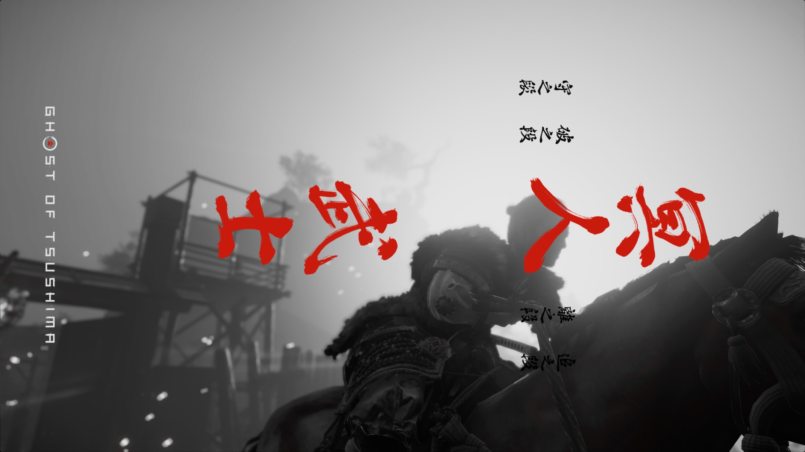

# Ghost of Tsushima (对马岛之魂) — Omarchy Theme

An evocative, cinematic dark theme for [Omarchy](https://omarchy.org), inspired by Sucker Punch Productions' *Ghost of Tsushima* (对马岛之魂).

Embody the duality of samurai honor and the way of the Ghost: deep sumi-e ink charcoal, weathered Sakai clan armor, fiery crimson maple leaves (红叶之赤), vibrant golden ginkgo foliage (黄金银杏), and pale pampas reeds beneath stormy skies.



## Design Philosophy

- **Background & Canvas (`#0e1014`, `#08090d`)**: Deep sumi-e ink black and midnight charcoal evoking night stealth, bamboo grove shadows, and stormy seas off the Komoda coast.
- **Foreground & Text (`#ded9d2`, `#f7f3ec`)**: Ancient Japanese washi paper and the bone-white hue of duel sands and pampas grass.
- **Primary Accent (`#c83833`)**: Momiji scarlet (红叶朱红) and the crimson banner of Clan Sakai, representing Jin Sakai's lethal blade and samurai legacy.
- **Secondary Accent (`#dca842`)**: Golden Temple ginkgo yellow (黄金银杏), representing ancient wisdom and autumn foliage across Izuhara and Toyotama.
- **Hyprland Dual-Tone Active Gradient**: `rgba(c83833ee) rgba(dca842ee) 45deg` — a striking 45-degree transition from Sakai Crimson to Golden Ginkgo, mirroring wind-borne leaves in battle.
- **Muted & Selection (`#282329`, `#66626c`)**: Subtle wisteria violet shadows and weathered Shinto shrine granite.

## Palette Reference

| Token | Hex | Aesthetic / Lore |
|---|---|---|
| `background` | `#0e1014` | 浓墨玄黑 (Sumi ink black) |
| `dark_background` | `#08090d` | 夜行战鬼 (Shadow of the Ghost) |
| `darker_background` | `#050608` | 深渊幽夜 (Abyssal night) |
| `lighter_background` | `#181a21` | 境井铠甲 (Lacquered iron armor) |
| `foreground` | `#ded9d2` | 和纸芒白 (Washi paper & pampas reed) |
| `bright_foreground` | `#f7f3ec` | 寒芒霜雪 (Gleaming blade steel) |
| `accent` | `#c83833` | 境井朱红 (Momiji scarlet / Sakai crimson) |
| `selection` | `#282329` | 紫藤幽影 (Wisteria night shadow) |
| `muted` | `#66626c` | 古刹石青 (Weathered shrine stone) |
| `red` | `#c83833` | 枫叶朱红 (Autumn crimson maple) |
| `orange` | `#d56c38` | 鸟居丹赤 (Torii gate cinnabar orange) |
| `yellow` | `#dca842` | 黄金银杏 (Golden Temple ginkgo) |
| `green` | `#5b8a62` | 境井青竹 (Tsushima bamboo & pine) |
| `cyan` | `#4f8f8b` | 海雾苍茫 (Tsushima coastal sea mist) |
| `blue` | `#4b7099` | 小茂田海 (Komoda storm & ocean deep) |
| `magenta` | `#945c82` | 紫藤花落 (Wisteria blossoms) |
| `brown` | `#774f36` | 战甲皮革 (Armor cord & Tsushima loam) |

## Wallpapers (Backgrounds)

Includes 12 curated 4K/2K ultra-crisp artworks:
1. `01-jin-sakai-blade.jpg` — 境井仁拔刀立于长风之中 (Jin drawing the Sakai Katana, 4K)
2. `02-golden-forest-ginkgo.jpg` — 黄金寺古刹与金黄银杏 (Golden Temple falling foliage, 4K)
3. `03-crimson-autumn-leaves.jpg` — 青海村枫叶漫天飞舞 (Crimson maple leaves of Omi Village, 4K)
4. `04-pampas-grass-duel.jpg` — 芒草花海绝美对决 (Dueling across the white pampas fields, 4K)
5. `05-ghost-stance-blood.jpg` — 战鬼之姿·月夜血影 (Ghost Stance in misty moonlight, 4K)
6. `06-komoda-beach-twilight.jpg` — 小茂田海滩残阳晚霞 (Twilight clouds over Komoda Beach, 4K)
7. `07-shadow-samurai-mask.jpg` — 战鬼面具与家传铠甲 (The Ghost Mask & Sakai Armor, 4K)
8. `08-sakai-mon-crest.jpg` — 境井家家纹与战鬼图腾 (Sakai Clan Mon emblem in gold lacquer, 4K)
9. `09-bamboo-strike.jpg` — 竹场修练与对马密林 (Bamboo strike training grove, 2.5K)
10. `10-storm-over-tsushima.jpg` — 暴风海岸与汹涌浪涛 (Storm clouds over Tsushima cliffs, 2.5K)
11. `11-sunset-ronin.jpg` — 斗笠浪人立于夕阳残霞 (Ronin gazing into the setting sun, 2.5K)
12. `12-wisteria-shrine.jpg` — 水墨风紫藤花与古神社 (Wisteria bloom and ancient torii shrine, 2.5K)

Cycle wallpapers:
```bash
omarchy theme bg next
```
Or open the graphical wallpaper carousel:
```bash
omarchy theme bg-switcher
# Shortcut: Super + Alt + W
```

## Typography & Fonts (字体推荐)

To capture the true samurai aesthetic:
- **Terminal & Code**: `Maple Mono NF CN` or `JetBrainsMono Nerd Font` (sharp, modern monospace with ligature support).
- **Japanese / CJK**: `Noto Serif CJK JP` / `Noto Serif CJK SC` (traditional Mincho/Song serif calligraphy style, matching the in-game titles and dialogue).
- Switch system font via Omarchy safely anytime:
  ```bash
  omarchy font set "Maple Mono NF CN"
  # or
  omarchy font set "JetBrainsMono Nerd Font"
  ```

## Switching & Reverting (主题切换与撤回)

### Activate Ghost of Tsushima:
```bash
omarchy theme set "Ghost Of Tsushima"
```
Or press `Super + Alt + Space` → select **Theme** → choose **Ghost Of Tsushima**.

### Revert to Another Theme:
Switching back is instant, clean, and completely non-destructive:
```bash
omarchy theme set "No Rest For The Wicked"
# or
omarchy theme set "Kanagawa"
```
All system configuration files (Alacritty, Kitty, Ghostty, Foot, Hyprland, Waybar/Shell, Neovim, Btop, VS Code, Obsidian) will seamlessly hot-reload.

## Icons

Defaulted to `Yaru-red-dark` to match the Sakai crimson accents across file managers and desktop panels.

## License

MIT — see [LICENSE](LICENSE). Artworks and game trademarks © Sucker Punch Productions & Sony Interactive Entertainment.
